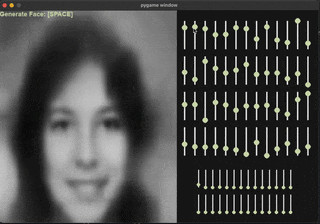
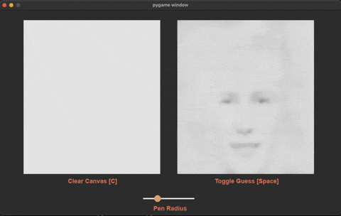

# 🎭 Latent Face Explorer

A playground for exploring the power and limitations of autoencoders for image generation. This project uses a convolutional autoencoder trained on grayscale high school yearbook faces to map facial images into a compact 80-dimensional latent space — then lets you *interactively manipulate* those latent variables in real time.

---

## 📌 Overview

This project is a hands-on experiment in generative modeling using autoencoders. Instead of jumping into complex GAN architectures (which scared me at the time), it embraces simplicity and interpretability. The core idea is to reduce facial images to a compact latent vector, then decode them back to image space — and give users a way to interact with those latent dimensions directly.

Built using TensorFlow for the model and Pygame for the interface, it enables two main modes:

- **Latent Slider Mode**: Adjust individual latent variables with sliders and watch how the output face changes.
- **Draw Mode**: Sketch your own grayscale image and watch how the trained autoencoder interprets it.

---

## 🔧 Features

- **Autoencoder-based Face Generator**  
  Trained on grayscale high school portraits, reduced to 80 latent variables.

- **Interactive Latent Control UI**  
  Modify each latent variable with sliders in real time. See how facial features morph and shift.

- **Live Drawing Interface**  
  Draw your own grayscale face, feed it into the model, and view the autoencoder's interpretation as you sketch.

- **Dimensionality Bottleneck**  
  Latent space compression forces the model to learn meaningful representations — ideal for experimentation.

- **Built in Pygame**  
  No heavy frontends, no extra dependencies. Just a lightweight, responsive interface you can run locally.

---

## 🧠 How It Works (High-Level)

1. **Data**  
   Grayscale facial portraits from a high school yearbook dataset. This was chosen as I was looking for small, uniform images for clean training.

2. **Model Architecture**  
   A convolutional autoencoder:
   - **Encoder**: Compresses the image into an 80-dimensional latent vector.
   - **Decoder**: Broadcasts the latent vector back up to image space to reconstruct the input.

3. **Training Objective**  
   Self-supervised reconstruction: minimize the pixel-wise difference between the input image and its reconstruction.

4. **Interactivity**  
   - Latent vectors can be manually adjusted via sliders in the UI.
   - User-drawn images are passed through the encoder and decoded live, enabling exploratory feedback.

---

## Demo 📸

- **Latent Slider Mode** | **Drawing Mode** 

<p style="display: flex; align-items:center">
    
    
</p>


## 😶‍🌫️ Why the Faces Look a Bit Blurry

Autoencoders, unlike GANs, are fundamentally **reconstructive**, not **generative**. This means they're optimized for *accuracy*, not *sharpness*. More specifically:

- The latent space is trained to follow a **normal distribution**.
- This means that assumptions are made on the latent variables that may not necessarily hold.
- Additionally, when decoding there's no adversarial pressure to produce *photo-realistic* sharpness.
- As a result, the output tends to reflect the *average* interpretation of features — leading to *blurry or smoothed faces*.

This isn't a bug. It's a consequence of the design — and part of why GANs were created and why I will be exploring that next.

## Mac OS Setup 💻

This setup is tailored for Mac OS users.

### Prerequisites

1. Install `pyenv`
    - We use `pyenv` to start a virtual environment with a specific python version
    - Through Homebrew:
        ```bash
        brew install pyenv
        ```
    
### Virtual Environment And Run

1. **Create Virtual Environment**:
    - You must ensure to start a virtual environment in Python version 3.10
    - Thus we install Python version 3.10 through `pyenv`
        ```bash
        pyenv install 3.10.13
        ```

2. **Create Virtual Environment**:
    - In the root directory create a virtual environment with specific version
        ```bash
        python3.10 -m venv env
        ```

3. **Activate It**
    ```bash
    source env/bin/activate
    ```

4. **Install dependencies using `requirements.txt`**
    ```bash
    pip install -r requirements.txt
    ```

5. **Run The Application**
    ```bash
    python3 main.py
    ```

6. **Deactivate The Environment**
    ```bash
    deactivate
    ```

## 🚀 Usage

This codebase is designed to be **modular**, **well-documented**, and **easy to extend or modify**. Every major function includes docstrings, and the logic is structured clearly so you can understand or modify behaviours without hunting through spaghetti code.

### 🔄 Switching Modes

The project supports multiple modes of operation. Switching between them is dead simple:

1. Open `main.py`.
2. In the `main()` function, **comment/uncomment the function calls** corresponding to the mode you want.

Available modes:

- `print_faces()` - Get a visualisation of the input images
- `learn()` – Train the autoencoder from scratch (or continue training on an already created model) on the dataset.
- `test_auto()` – Test reconstruction quality of the trained model.
- `latent_space_inference()` – Inspect the latent vectors to gain a better understanding.
- `generate_faces()` – Launch interactive slider-based latent exploration.
- `draw_faces()` – Launch the drawing interface to input your own faces.

This allows you to quickly toggle between training, testing, and interactive generation — without changing any config files or passing arguments.

- **Note:** I am not including the numpy data as it is too large in size, however I will link to the dataset and you can use the provided functions from this repo to reconstruct the training and test data in numpy format.


# Contributions

- [Dataset - A Century of Portraits](https://shiry.ttic.edu/projects/yearbooks/yearbooks.html)
- [Matplotlib — Visualization with Python](https://matplotlib.org/)
- [NumPy](https://numpy.org/)
- [TensorFlow](https://www.tensorflow.org/)
- [pygame wiki - Getting Started](https://www.pygame.org/wiki/GettingStarted)

